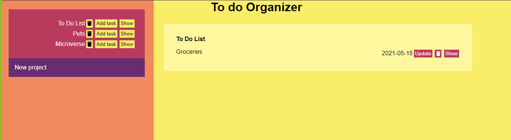

# Todo list

>  Todo list project, rendered dynamically by DOM manipulation, and the use of modularized code using webpack.

## Built With

- HTML5
- CSS3
- JavaScript
- Webpack

## Live Demo

[Live Demo Link]()

## Getting Started

To get a local copy up and running follow these simple example steps.

### Setup and Install

- Clone this repository using the link above (click on the 'code' button)
- Open a terminal and `cd` to the cloned repository
- run `npm install`
- run `npm run build` 

### Usage

- Click on  `Add Task` or `Show` or the delete icon  to navigate in To Do List project.
- Click on `new project` if you want to create a project.
- Click on `Add Task` or `Show` or the delete icon  to navigate in your projects.
- Click on `Update` or `Show` or the delete icon  to navigate in your tasks.

### Deployment

- Deployed on GitHub Pages

## Authors

👤 **Alicia Rojas**

- GitHub: [@aliciapaz](https://github.com/aliciapaz)
- Twitter: [@_alicia_paz](https://twitter.com/_alicia_paz)
- LinkedIn: [Alicia Rojas](https://www.linkedin.com/in/aliciapazrojas/)

👤  **Rocio Martinez** 
- Github: [@Rocio01](https://github.com/Rocio01) 
- Twitter: [@rugiada8801](https://twitter.com/rugiada8801) 
- Linkedin: [zulma-rocio-martinez](https://www.linkedin.com/in/zulma-rocio-martinez) 

## 🤝 Contributing

Contributions, issues, and feature requests are welcome!

Feel free to check the [issues page](https://github.com/aliciapaz/todo-list/issues).

## Show your support

Give a ⭐️ if you like this project!

## Acknowledgments

- [The Odin Project](https://www.theodinproject.com/paths/full-stack-ruby-on-rails/courses/javascript/lessons/todo-list)

## 📝 License

This project is [MIT](LICENSE) licensed.
